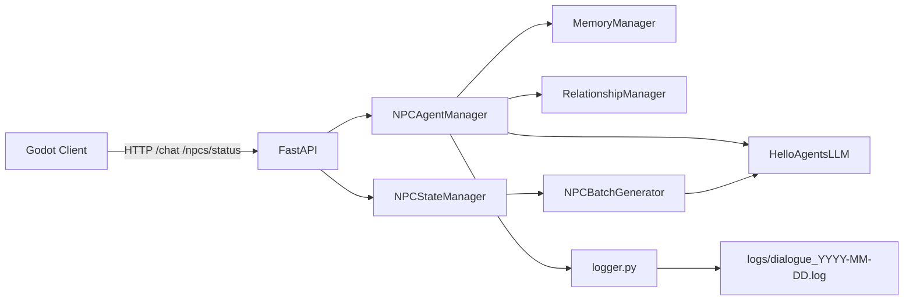
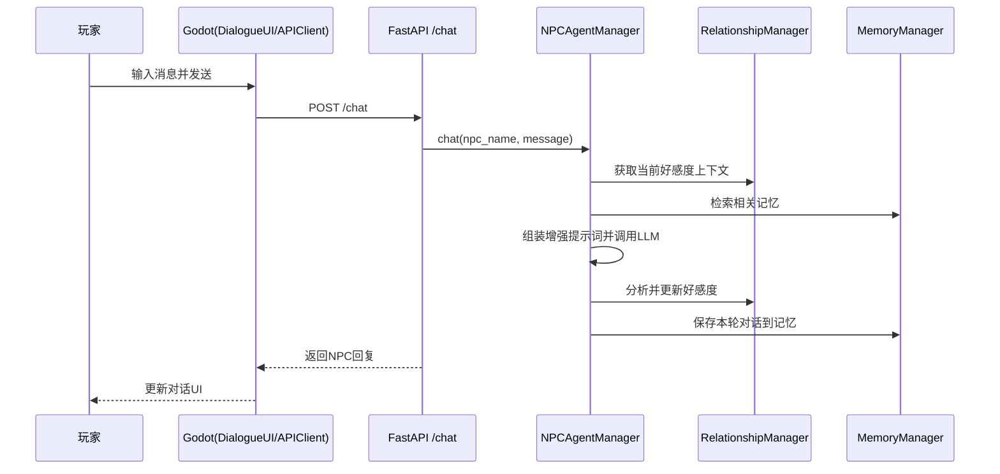
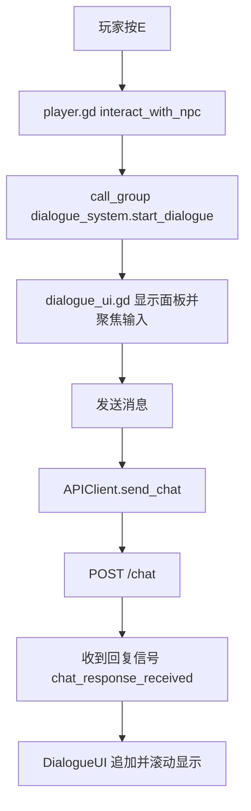
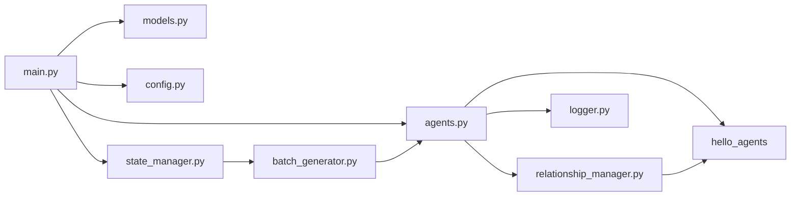

# 赛博小镇（Helloagents-AI-Town）Code Wiki

> 版本：基于当前仓库代码自动分析生成  
> 项目类型：Godot 4 客户端 + FastAPI 后端 + HelloAgents 多智能体

---

## 1. 项目定位与目标

`Helloagents-AI-Town` 是一个 AI NPC 对话模拟项目，核心目标是让玩家在 2D 小镇场景中与 NPC 进行自然对话，并结合：

- NPC 自主状态更新（批量生成）
- NPC 个体记忆（短期 + 长期）
- 玩家与 NPC 关系/好感度动态演化
- 可观测日志系统（控制台 + 文件）

系统由两部分构成：

1. **Godot 客户端**：玩家移动、NPC 交互、UI 展示、HTTP 调用后端
2. **Python 后端**：对话推理、记忆管理、好感度计算、状态批量生成、REST API

---

## 2. 整体架构

### 2.1 分层架构图



### 2.2 关键运行链路



---

## 3. 仓库结构（核心部分）

```text
Helloagents-AI-Town/
├── backend/                      # FastAPI 后端
│   ├── main.py                   # API入口 + 生命周期
│   ├── agents.py                 # NPC Agent 管理（对话、记忆、好感度聚合）
│   ├── relationship_manager.py   # 好感度分析与更新
│   ├── batch_generator.py        # 批量NPC状态/对话生成
│   ├── state_manager.py          # 定时更新与状态缓存
│   ├── models.py                 # Pydantic 请求/响应模型
│   ├── config.py                 # 后端配置
│   ├── logger.py                 # 日志系统
│   ├── view_logs.py              # 日志查看工具
│   ├── requirements.txt          # Python依赖
│   └── memory_data/              # NPC记忆数据目录（运行期）
├── helloagents-ai-town/          # Godot 客户端项目
│   ├── project.godot             # Godot工程配置（含AutoLoad）
│   ├── scenes/
│   │   ├── main.tscn             # 主场景
│   │   ├── player.tscn           # 玩家场景
│   │   ├── npc.tscn              # NPC场景
│   │   └── dialogue_ui.tscn      # 对话UI场景
│   ├── scripts/
│   │   ├── main.gd               # 主场景逻辑（定时拉取NPC状态）
│   │   ├── player.gd             # 玩家移动与交互输入
│   │   ├── npc.gd                # NPC巡逻与交互范围管理
│   │   ├── dialogue_ui.gd        # 对话面板逻辑
│   │   ├── api_client.gd         # HTTP通信客户端
│   │   └── config.gd             # 全局常量与日志函数
│   └── assets/                   # 角色、场景、音效等资源
├── README.md
├── SETUP_GUIDE.md
├── AFFINITY_SYSTEM_GUIDE.md
├── MEMORY_SYSTEM_GUIDE.md
└── DIALOGUE_LOG_GUIDE.md
```

---

## 4. 后端设计（FastAPI）

## 4.1 启动与生命周期

`backend/main.py` 使用 `lifespan` 在启动时完成：

1. 配置校验（`settings.validate()`）
2. 初始化 NPC 管理器（`get_npc_manager()`）
3. 初始化并启动状态管理器（`get_state_manager(...).start()`）

关闭时停止状态管理器后台任务。

## 4.2 模块职责一览

| 模块 | 职责 | 核心对象 |
|---|---|---|
| `config.py` | 全局配置与环境变量读取 | `Settings` |
| `models.py` | API 数据模型定义 | `ChatRequest`、`ChatResponse` 等 |
| `main.py` | FastAPI 路由、生命周期、管理器装配 | `app`、`lifespan` |
| `agents.py` | NPC 对话编排、记忆检索/写入、好感度联动 | `NPCAgentManager` |
| `relationship_manager.py` | 对话情感分析并更新好感度 | `RelationshipManager` |
| `batch_generator.py` | 一次 LLM 调用批量生成所有 NPC 状态文本 | `NPCBatchGenerator` |
| `state_manager.py` | 定时任务循环、状态缓存、对外查询 | `NPCStateManager` |
| `logger.py` | 对话日志落盘与控制台输出 | `dialogue_logger` |
| `view_logs.py` | tail/view/list 日志工具 | `tail_log_file` 等 |

## 4.3 关键类与函数说明

### A) `NPCAgentManager`（`backend/agents.py`）

- `chat(npc_name, message, player_id)`：后端核心链路函数
  - 获取好感度上下文
  - 检索记忆（working + episodic）
  - 构造增强提示并调用 Agent
  - 执行情感分析并更新好感度
  - 持久化本轮对话到记忆系统
- `_create_memory_manager(npc_name)`：为每个 NPC 建立独立记忆存储
- `_save_conversation_to_memory(...)`：写入玩家消息 + NPC回复，附带情感/好感度元数据
- `get_npc_info/get_all_npcs`：提供 NPC 基础信息
- `get_npc_memories/clear_npc_memory`：记忆查询与清理
- `get_npc_affinity/get_all_affinities/set_npc_affinity`：好感度接口封装

### B) `RelationshipManager`（`backend/relationship_manager.py`）

- `analyze_and_update_affinity(...)`：调用分析 Agent 产出 JSON，更新 `0~100` 好感度
- `_parse_analysis(response)`：多策略解析（直接 JSON / 截取 JSON / 正则兜底）
- `get_affinity_level(affinity)`：好感度分级（陌生/熟悉/友好/亲密/挚友）
- `get_affinity_modifier(affinity)`：将分级映射成“对话风格修饰词”

### C) `NPCBatchGenerator`（`backend/batch_generator.py`）

- `generate_batch_dialogues(context=None)`：批量生成所有 NPC 状态文案
- `_build_batch_prompt(context)`：构造严格 JSON 输出约束的提示词
- `_parse_response(response)`：解析 LLM 返回，失败时回落预设文案
- `_get_current_context()`：按当前时段生成场景语境

### D) `NPCStateManager`（`backend/state_manager.py`）

- `start()/stop()`：启动/停止后台自动更新任务
- `_auto_update_loop()`：按 `update_interval` 循环更新状态
- `_update_npc_states()`：调用批量生成器并刷新缓存
- `get_current_state()`：提供当前对话、上次更新时间、下次倒计时
- `force_update()`：手动触发一次刷新

## 4.4 API 设计（main.py）

| 方法 | 路径 | 用途 |
|---|---|---|
| GET | `/` | 服务信息与功能摘要 |
| GET | `/health` | 健康检查 |
| POST | `/chat` | 与指定NPC对话 |
| GET | `/npcs` | NPC列表 |
| GET | `/npcs/status` | 批量NPC当前状态 |
| POST | `/npcs/status/refresh` | 强制刷新NPC状态 |
| GET | `/npcs/{npc_name}` | 单个NPC详细信息 |
| GET | `/npcs/{npc_name}/memories` | 获取NPC记忆 |
| DELETE | `/npcs/{npc_name}/memories` | 清空NPC记忆 |
| GET | `/npcs/{npc_name}/affinity` | 获取NPC好感度 |
| GET | `/affinities` | 获取所有NPC好感度 |
| PUT | `/npcs/{npc_name}/affinity` | 设置好感度（测试/调试） |

---

## 5. 客户端设计（Godot）

## 5.1 AutoLoad 与全局单例

`project.godot` 中注册了两个 AutoLoad：

- `Config -> res://scripts/config.gd`
- `APIClient -> res://scripts/api_client.gd`

这使得任意脚本可通过 `/root/APIClient` 和 `Config` 常量访问全局能力。

## 5.2 脚本职责拆分

| 脚本 | 角色 |
|---|---|
| `config.gd` | 全局常量（API地址、速度、轮询间隔）+ 日志工具 |
| `api_client.gd` | HTTP 请求封装，发射对话/状态信号 |
| `player.gd` | 玩家移动、交互输入、音效管理、交互状态开关 |
| `npc.gd` | NPC 交互区域检测、巡逻逻辑、头顶对话显示 |
| `dialogue_ui.gd` | 对话窗口、输入处理、消息发送与展示 |
| `main.gd` | 场景协调器：定时拉取 `/npcs/status` 并分发到NPC |

## 5.3 场景与节点关系

- `main.tscn`：`Main` + `Player` + `NPCs` + `DialogueUI` + `Walls` + BGM
- `npc.tscn`：`CharacterBody2D` + `InteractionArea` + 名称/对话 Label
- `player.tscn`：`CharacterBody2D` + 动画 + 相机 + 音效节点
- `dialogue_ui.tscn`：底部面板对话 UI

## 5.4 客户端交互流



---

## 6. 依赖关系

## 6.1 Python依赖（`backend/requirements.txt`）

- `fastapi`：Web API 框架
- `uvicorn[standard]`：ASGI 服务器
- `pydantic`：请求响应模型校验
- `requests`、`httpx`：HTTP（其中 `httpx` 常用于测试）
- `python-multipart`：表单解析支持
- `pytest`：测试框架（当前仓库未包含对应测试脚本）
- `hello-agents`：多智能体与记忆能力核心依赖

## 6.2 模块调用依赖图（后端）



## 6.3 外部运行依赖

- Godot 4.2+
- Python 3.10+（文档声明）
- LLM 服务与 API Key（`LLM_API_KEY`）
- HelloAgents 相关依赖环境（按 `.env.example` 可配置 ModelScope/Qdrant/Neo4j）

---

## 7. 核心数据与状态模型

## 7.1 NPC角色静态配置

`backend/agents.py` 中 `NPC_ROLES` 定义每个 NPC 的：

- 职位/位置/活动
- 性格/专长/风格/爱好

并通过 `create_system_prompt()` 注入 Agent 系统提示词，形成稳定人格。

## 7.2 对话请求/响应模型（Pydantic）

- `ChatRequest`：`npc_name` + `message`
- `ChatResponse`：`npc_name`、`npc_title`、`message`、`success`、`timestamp`
- `NPCStatusResponse`：`dialogues`、`last_update`、`next_update_in`

## 7.3 记忆条目元数据（写入时）

每轮对话会分别写入“玩家消息”和“NPC回复”，并记录：

- `speaker`、`player_id`、`session_id`
- `timestamp`
- `affinity`、`affinity_change`
- `sentiment`
- `context.interaction_type = dialogue`

## 7.4 好感度区间语义

- `0~20`: 陌生
- `20~40`: 熟悉
- `40~60`: 友好
- `60~80`: 亲密
- `80~100`: 挚友

并映射到不同“语气修饰词”影响后续回复风格。

---

## 8. 项目运行方式（推荐）

## 8.1 后端启动

```bash
cd /Users/remy/Desktop/Helloagents-AI-Town/backend
python -m venv venv
source venv/bin/activate
pip install -r requirements.txt
cp .env.example .env
# 编辑 .env 填写 LLM_API_KEY 等
python main.py
```

启动后访问：

- API 文档：`http://localhost:8000/docs`
- 健康检查：`http://localhost:8000/health`

## 8.2 客户端启动（Godot）

1. 用 Godot 导入项目：`/Users/remy/Desktop/Helloagents-AI-Town/helloagents-ai-town/project.godot`
2. 运行主场景（默认已配置为 `scenes/main.tscn`）
3. 游戏内：`W/A/S/D` 移动，`E` 交互，`Enter` 发送，`ESC` 关闭对话框

## 8.3 联调验证

- 先启动后端，再运行 Godot
- 观察 Godot 控制台是否出现 `GET /npcs/status` 周期调用
- 与 NPC 对话后查看后端 `logs/dialogue_YYYY-MM-DD.log`

---

## 9. 配置说明

## 9.1 后端配置（`backend/config.py` + `.env`）

关键项：

- `API_HOST` / `API_PORT`
- `NPC_UPDATE_INTERVAL`（默认 30 秒）
- `LLM_MODEL_ID`
- `LLM_API_KEY`
- `LLM_BASE_URL`
- `CORS_ORIGINS`

## 9.2 前端配置（`helloagents-ai-town/scripts/config.gd`）

关键项：

- `API_BASE_URL`（默认 `http://localhost:8000`）
- `PLAYER_SPEED`
- `INTERACTION_DISTANCE`
- `NPC_STATUS_UPDATE_INTERVAL`
- `DEBUG_MODE`

---

## 10. 扩展与二次开发指南

## 10.1 新增 NPC（后端 + 前端）

1. 后端：在 `backend/agents.py` 的 `NPC_ROLES` 增加角色配置
2. 前端：在 `main.tscn` 实例化 `npc.tscn` 并设置 `npc_name`/`npc_title`
3. 前端：更新 `scripts/main.gd` 的 `get_npc_node()` 映射
4. 如需批量状态一致性，确保批量提示词覆盖新 NPC

## 10.2 新增 API

1. 在 `backend/models.py` 定义请求/响应模型
2. 在 `backend/main.py` 增加路由
3. 在 `helloagents-ai-town/scripts/api_client.gd` 增加请求方法和 signal
4. 在对应 UI 或场景脚本接收 signal 并渲染

## 10.3 调整 NPC 行为刷新策略

- 后端批量生成频率：`Settings.NPC_UPDATE_INTERVAL`
- 前端轮询频率：`Config.NPC_STATUS_UPDATE_INTERVAL`
- 建议两端保持一致（避免 UI 拉取过快或过慢）

---

## 11. 维护观察与注意事项

1. **HelloAgents 路径与安装策略并存**：
   `agents.py`/`batch_generator.py`/`relationship_manager.py` 存在 `sys.path.insert('../HelloAgents')`，但仓库中未见 `HelloAgents/` 目录，实际通常依赖 `pip install hello-agents`。

2. **文档与代码存在少量漂移**：
   说明文档提到 `test_api.py`、`test_memory.py` 等脚本，但当前仓库未包含。

3. **Python版本说明不一致**：
   - 顶层 `pyproject.toml`：`>=3.12`
   - 文档说明：`>=3.10`
   建议团队统一最低版本并更新文档。

4. **资源路径大小写风险（跨平台）**：
   `player.tscn` 内音频路径为 `assets/Audio/...`，实际目录是 `assets/audio/...`；在大小写敏感文件系统（如 Linux）可能导致资源加载失败。

5. **运行产物已在仓库中**：
   `backend/venv`、`backend/memory_data/*.db`、`.godot/` 等属于运行期文件，建议根据团队规范决定是否纳入版本管理。

---

## 12. 快速索引（关键文件）

- 后端入口：`backend/main.py`
- Agent 核心：`backend/agents.py`
- 好感度系统：`backend/relationship_manager.py`
- 批量状态更新：`backend/state_manager.py` + `backend/batch_generator.py`
- 数据模型：`backend/models.py`
- 日志：`backend/logger.py` + `backend/view_logs.py`
- 客户端入口：`helloagents-ai-town/scenes/main.tscn`
- 客户端脚本：`helloagents-ai-town/scripts/*.gd`
- 工程设置：`helloagents-ai-town/project.godot`

