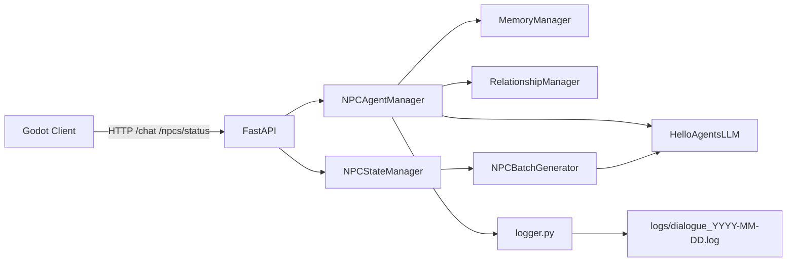
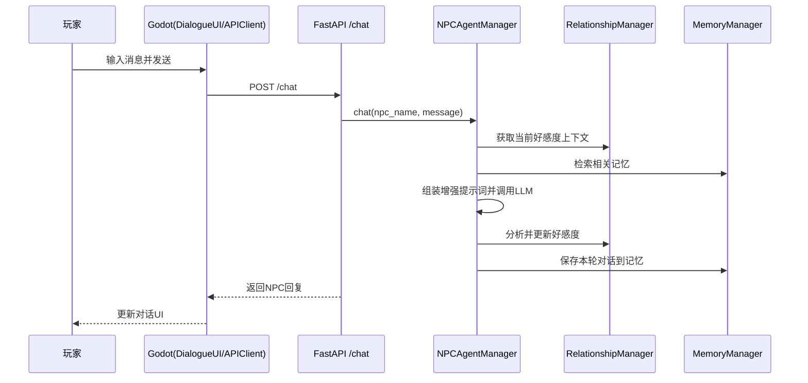

# 01. 架构总览

## 1. 项目定位与目标

`Helloagents-AI-Town` 是一个 AI NPC 对话模拟项目，核心目标是让玩家在 2D 小镇场景中与 NPC 进行自然对话，并结合：

- NPC 自主状态更新（批量生成）
- NPC 个体记忆（短期 + 长期）
- 玩家与 NPC 关系/好感度动态演化
- 可观测日志系统（控制台 + 文件）

系统由两部分构成：

1. **Godot 客户端**：玩家移动、NPC 交互、UI 展示、HTTP 调用后端
2. **Python 后端**：对话推理、记忆管理、好感度计算、状态批量生成、REST API

---

## 2. 整体架构

### 2.1 分层架构图



### 2.2 关键运行链路



---

## 3. 仓库结构（核心部分）

```text
Helloagents-AI-Town/
├── backend/                      # FastAPI 后端
│   ├── main.py                   # API入口 + 生命周期
│   ├── agents.py                 # NPC Agent 管理（对话、记忆、好感度聚合）
│   ├── relationship_manager.py   # 好感度分析与更新
│   ├── batch_generator.py        # 批量NPC状态/对话生成
│   ├── state_manager.py          # 定时更新与状态缓存
│   ├── models.py                 # Pydantic 请求/响应模型
│   ├── config.py                 # 后端配置
│   ├── logger.py                 # 日志系统
│   ├── view_logs.py              # 日志查看工具
│   ├── requirements.txt          # Python依赖
│   └── memory_data/              # NPC记忆数据目录（运行期）
├── helloagents-ai-town/          # Godot 客户端项目
│   ├── project.godot             # Godot工程配置（含AutoLoad）
│   ├── scenes/
│   │   ├── main.tscn             # 主场景
│   │   ├── player.tscn           # 玩家场景
│   │   ├── npc.tscn              # NPC场景
│   │   └── dialogue_ui.tscn      # 对话UI场景
│   ├── scripts/
│   │   ├── main.gd               # 主场景逻辑（定时拉取NPC状态）
│   │   ├── player.gd             # 玩家移动与交互输入
│   │   ├── npc.gd                # NPC巡逻与交互范围管理
│   │   ├── dialogue_ui.gd        # 对话面板逻辑
│   │   ├── api_client.gd         # HTTP通信客户端
│   │   └── config.gd             # 全局常量与日志函数
│   └── assets/                   # 角色、场景、音效等资源
├── README.md
├── SETUP_GUIDE.md
├── AFFINITY_SYSTEM_GUIDE.md
├── MEMORY_SYSTEM_GUIDE.md
└── DIALOGUE_LOG_GUIDE.md
```

---

