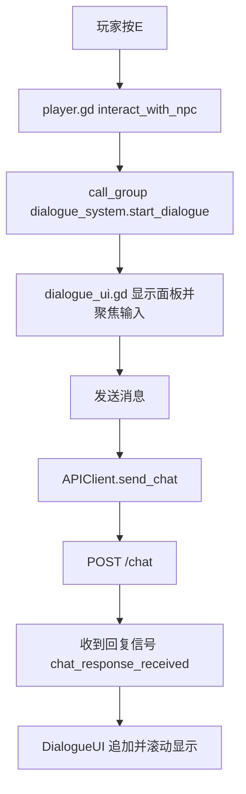

# 03. 客户端设计（Godot）

## 5. 客户端设计（Godot）

## 5.1 AutoLoad 与全局单例

`project.godot` 中注册了两个 AutoLoad：

- `Config -> res://scripts/config.gd`
- `APIClient -> res://scripts/api_client.gd`

这使得任意脚本可通过 `/root/APIClient` 和 `Config` 常量访问全局能力。

## 5.2 脚本职责拆分

| 脚本 | 角色 |
|---|---|
| `config.gd` | 全局常量（API地址、速度、轮询间隔）+ 日志工具 |
| `api_client.gd` | HTTP 请求封装，发射对话/状态信号 |
| `player.gd` | 玩家移动、交互输入、音效管理、交互状态开关 |
| `npc.gd` | NPC 交互区域检测、巡逻逻辑、头顶对话显示 |
| `dialogue_ui.gd` | 对话窗口、输入处理、消息发送与展示 |
| `main.gd` | 场景协调器：定时拉取 `/npcs/status` 并分发到NPC |

## 5.3 场景与节点关系

- `main.tscn`：`Main` + `Player` + `NPCs` + `DialogueUI` + `Walls` + BGM
- `npc.tscn`：`CharacterBody2D` + `InteractionArea` + 名称/对话 Label
- `player.tscn`：`CharacterBody2D` + 动画 + 相机 + 音效节点
- `dialogue_ui.tscn`：底部面板对话 UI

## 5.4 客户端交互流

---

