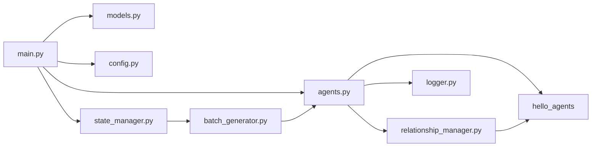

# 04. 依赖关系

## 6. 依赖关系

## 6.1 Python依赖（`backend/requirements.txt`）

- `fastapi`：Web API 框架
- `uvicorn[standard]`：ASGI 服务器
- `pydantic`：请求响应模型校验
- `requests`、`httpx`：HTTP（其中 `httpx` 常用于测试）
- `python-multipart`：表单解析支持
- `pytest`：测试框架（当前仓库未包含对应测试脚本）
- `hello-agents`：多智能体与记忆能力核心依赖

## 6.2 模块调用依赖图（后端）

## 6.3 外部运行依赖

- Godot 4.2+
- Python 3.10+（文档声明）
- LLM 服务与 API Key（`LLM_API_KEY`）
- HelloAgents 相关依赖环境（按 `.env.example` 可配置 ModelScope/Qdrant/Neo4j）

---

